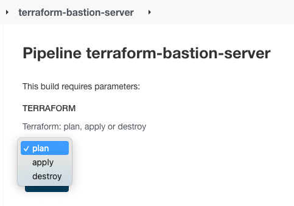

<h1 align="center">Jenkins</h1>
<h6 align="center">This README will describe all Jenkins Jobs on My Project</h6>

## Application diagram

Jenkins Link : https://jenkins.kandula.click/

## Table of Contents

- [Jenkins-Terraform Deployment](#Jenkins-Terraform-Deployment)
- [Jenkins-Ansible Playbooks](#Jenkins-Ansible-Playbooks)
- [Jenkins-Kubernetes Deployment](#Jenkins-Kubernetes-Deployment)
- [Jenkins-Docker Images](#Jenkins-Docker-Images)
- [Jenkins-plugins](#Jenkins-plugins)

## Jenkins-Terraform Deployments

This view aggregate all terraform jenkins jobs

**Job Name: Terraform-Build-Kandula-Env:**  
The job will create All Env (will trigger all below jobs with the right logic)
+ [jenkins file location](/Jenkins/jenkins_jobs/jenkis_terraform_deployments/jenkins_terraform_build_kandula_env.groovy)
+ [jenkins job link](https://jenkins.kandula.click/view/Terraform_Deployment/job/Terraform-Build-Kandula-Env/)

**Job Name: terraform-bastion-server:**  
The job will create Bastion instance, this instance is exposed to the internet & will function as VPN server
+ [jenkins file location](/Jenkins/jenkins_jobs/jenkis_terraform_deployments/jenkins_terraform_bastion_server.groovy)
+ [jenkins job link](https://jenkins.kandula.click/view/Terraform_Deployment/job/terraform-bastion-server)

**Job Name: terraform-ebs_jenkins:**  
The job will create EBS Storage for Jenkins server to store all Jenkins Data & configs.
+ [jenkins file location](/Jenkins/jenkins_jobs/jenkis_terraform_deployments/jenkins_terraform_ebs_jenkins.groovy)
+ [jenkins job link](https://jenkins.kandula.click/view/Terraform_Deployment/job/terraform-ebs_jenkins/)

**Job Name: terraform-eks:**  
The job will create EKS Cluster.
+ [jenkins file location](/Jenkins/jenkins_jobs/jenkis_terraform_deployments/jenkins_terraform_eks.groovy)
+ [jenkins job link](https://jenkins.kandula.click/view/Terraform_Deployment/job/terraform-ebs_jenkins/)

**Job Name: terraform-jenkins:**  
The job will create Jenkins Server & Jenkins Slave ready to use.
+ [jenkins file location](/Jenkins/jenkins_jobs/jenkis_terraform_deployments/jenkins_terraform_jenkins.groovy)
+ [jenkins job link](https://jenkins.kandula.click/view/Terraform_Deployment/job/terraform-jenkins/)

**Job Name: terraform-postgres:**  
The job will create postgres DB on AWS RDS
+ [jenkins file location](/Jenkins/jenkins_jobs/jenkis_terraform_deployments/jenkins_terraform_postgres.groovy)
+ [jenkins job link](https://jenkins.kandula.click/view/Terraform_Deployment/job/terraform-postgres/)

**Job Name: terraform-s3-buckets:**  
The job will create S3 bucket for loging
+ [jenkins file location](/Jenkins/jenkins_jobs/jenkis_terraform_deployments/jenkins_terraform_s3_bucket.groovy)
+ [jenkins job link](https://jenkins.kandula.click/view/Terraform_Deployment/job/terraform-s3-buckets/)

**Job Name: terraform-servers:**  
The job will create instances for Elasticsearch, Consul and Prometheus
+ [jenkins file location](/Jenkins/jenkins_jobs/jenkis_terraform_deployments/jenkins_terraform_servers.groovy)
+ [jenkins job link](https://jenkins.kandula.click/view/Terraform_Deployment/job/terraform-servers/)

**Job Name: terraform-vpc:**  
The job will create VPC & private zone on Route53
+ [jenkins file location](/Jenkins/jenkins_jobs/jenkis_terraform_deployments/jenkins_terraform_vpc.groovy)
+ [jenkins job link](https://jenkins.kandula.click/view/Terraform_Deployment/job/terraform-vpc/)

## Jenkins-Ansible Playbooks

**Job Name: ansible-playbook-all-apps:**  
The job will provision all the EC2 Instances that we created via terraform
+ [jenkins file location](/Jenkins/jenkins_jobs/jenkins_ansible_playbooks/jenkins_ansible_build_kandula.groovy)
+ [ansible role location](/ansible/roles/)
+ [jenkins job link](https://jenkins.kandula.click/view/Ansible-Playbooks/job/ansible-playbook-all-apps/)

**Job Name: ansible-playbook-consul-agent:**  
The job will install consul agent on relevant instances 
+ [jenkins file location](/Jenkins/jenkins_jobs/jenkins_ansible_playbooks/consul_agent_ansible_playbook.groovy)
+ [ansible role location](/ansible/roles/consul_agent)
+ [jenkins job link](https://jenkins.kandula.click/view/Ansible-Playbooks/job/ansible-playbook-consul-agent/)

**Job Name: ansible-playbook-consul-registrator:**  
The job will install consul registrator on all servers that have docker engine 
+ [jenkins file location](/Jenkins/jenkins_jobs/jenkins_ansible_playbooks/consul_registrator_ansible_playbook.groovy)
+ [ansible role location](/ansible/roles/consul_registrator)
+ [jenkins job link](https://jenkins.kandula.click/view/Ansible-Playbooks/job/ansible-playbook-consul-registrator/)

**Job Name: ansible-playbook-consul-server:**  
The job will install consul server (cluster of 3 servers)
+ [jenkins file location](/Jenkins/jenkins_jobs/jenkins_ansible_playbooks/consul_server_ansible_playbook.groovy)
+ [ansible role location](/ansible/roles/consul)
+ [jenkins job link](https://jenkins.kandula.click/view/Ansible-Playbooks/job/ansible-playbook-consul-server/)

**Job Name: ansible-playbook-elasticsearch:**  
The job will install Elasticsearch & Kibana
+ [jenkins file location](/Jenkins/jenkins_jobs/jenkins_ansible_playbooks/elasticsearch_ansible_playbook.groovy)
+ [ansible role location](/ansible/roles/elasticsearch)
+ [jenkins job link](https://jenkins.kandula.click/view/Ansible-Playbooks/job/ansible-playbook-elasticsearch/)

**Job Name: ansible-playbook-filebeat-server:**  
The job will install filebeat 
+ [jenkins file location](/Jenkins/jenkins_jobs/jenkins_ansible_playbooks/filebeat_ansible_playbook.groovy)
+ [ansible role location](/ansible/roles/filebeat)
+ [jenkins job link](https://jenkins.kandula.click/view/Ansible-Playbooks/job/ansible-playbook-filebeat-server/)

**Job Name: ansible-playbook-logstahs-agent:**  
The job will install logstash
+ [jenkins file location](/Jenkins/jenkins_jobs/jenkins_ansible_playbooks/logstash_agent_ansible_playbook.groovy)
+ [ansible role location](/ansible/roles/logstash)
+ [jenkins job link](https://jenkins.kandula.click/view/Ansible-Playbooks/job/ansible-playbook-logstahs-agent/)

**Job Name: ansible-playbook-node-exporter:**  
The job will install Node Exporter
+ [jenkins file location](/Jenkins/jenkins_jobs/jenkins_ansible_playbooks/node_exporter_ansible_playbook.groovy)
+ [ansible role location](/ansible/roles/node_exporter)
+ [jenkins job link](https://jenkins.kandula.click/view/Ansible-Playbooks/job/ansible-playbook-node-exporter/)

**Job Name: ansible-playbook-prometheus:**  
The job will install prometheus
+ [jenkins file location](/Jenkins/jenkins_jobs/jenkins_ansible_playbooks/prometheus_ansible_playbook.groovy)
+ [ansible role location](/ansible/roles/prometheus)
+ [jenkins job link](https://jenkins.kandula.click/view/Ansible-Playbooks/job/ansible-playbook-prometheus/)

## Jenkins-Kubernetes Deployment

## Jenkins-Docker Images

## Jenkins Plugins