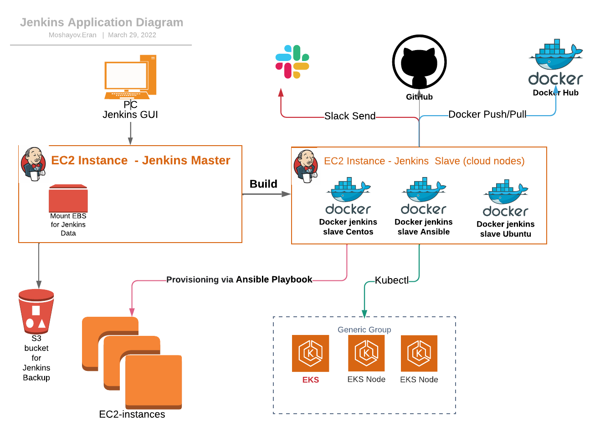
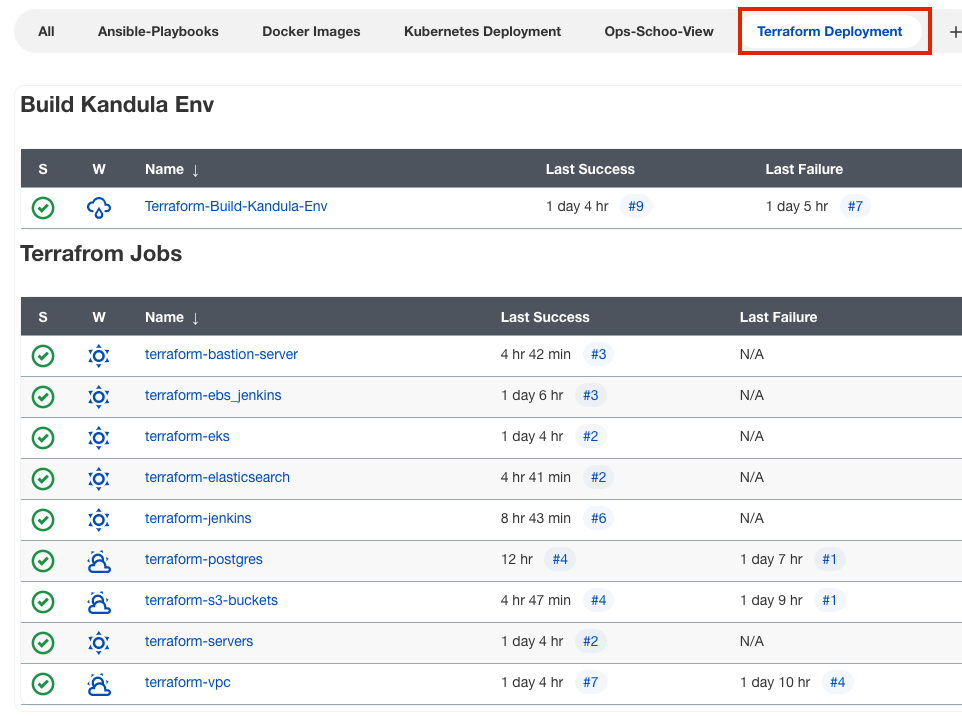
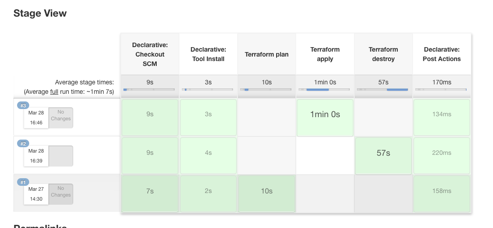
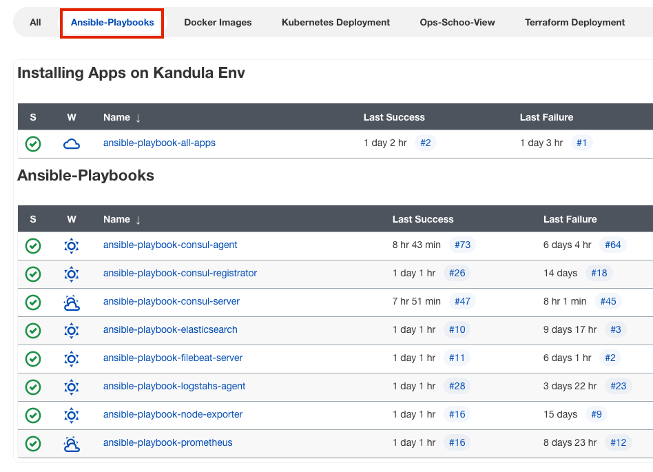
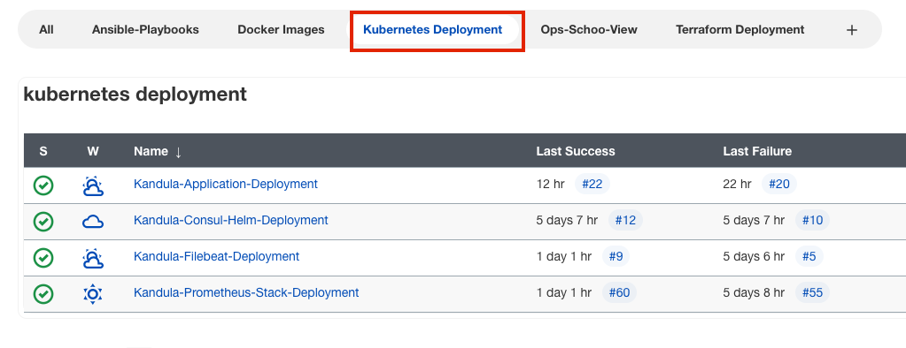
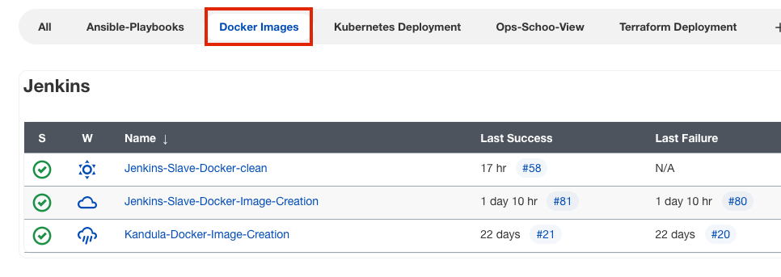

<h1 align="center">Jenkins</h1>
<h6 align="center">This README will describe all Jenkins Jobs on My Project</h6>

## Application diagram

Jenkins Link : https://jenkins.kandula.click/

## Table of Contents

- [Jenkins-Terraform Deployment](#Jenkins-Terraform-Deployment)
- [Jenkins-Ansible Playbooks](#Jenkins-Ansible-Playbooks)
- [Jenkins-Kubernetes Deployment](#Jenkins-Kubernetes-Deployment)
- [Jenkins-Docker Images](#Jenkins-Docker-Images)
- [Jenkins-plugins](#Jenkins-plugins)

## Jenkins-Terraform Deployments

This view aggregat all terraform jenkins jobs

Job Name: terraform-bastion-server:
The job will create Bastion instance, this instance is exposed to the internet & will function as VPN server
+ [jenkins file location](/Jenkins/jenkins_jobs/jenkis_terraform_deployments/jenkins_terraform_bastion_server.groovy)
+ [jenkins job link](https://jenkins.kandula.click/view/Terraform_Deployment/job/terraform-bastion-server/)

Job Name: terraform-ebs_jenkins:
The job will create EBS Storage for Jenkins server to store all Jenkins Data & configs.
+ [jenkins file location](/Jenkins/jenkins_jobs/jenkis_terraform_deployments/jenkins_terraform_ebs_jenkins.groovy)
+ [jenkins job link](https://jenkins.kandula.click/view/Terraform_Deployment/job/terraform-ebs_jenkins/)

**Job Name: terraform-eks:**
The job will create EBS Storage for Jenkins server to store all Jenkins Data & configs.
+ [jenkins file location](/Jenkins/jenkins_jobs/jenkis_terraform_deployments/jenkins_terraform_ebs_jenkins.groovy)
+ [jenkins job link](https://jenkins.kandula.click/view/Terraform_Deployment/job/terraform-ebs_jenkins/)

Job Name: terraform-ebs_jenkins:
The job will create EBS Storage for Jenkins server to store all Jenkins Data & configs.
+ [jenkins file location](/Jenkins/jenkins_jobs/jenkis_terraform_deployments/jenkins_terraform_ebs_jenkins.groovy)
+ [jenkins job link](https://jenkins.kandula.click/view/Terraform_Deployment/job/terraform-ebs_jenkins/)

## Jenkins-Ansible Playbooks

## Jenkins-Kubernetes Deployment

## Jenkins-Docker Images

## Jenkins Plugins