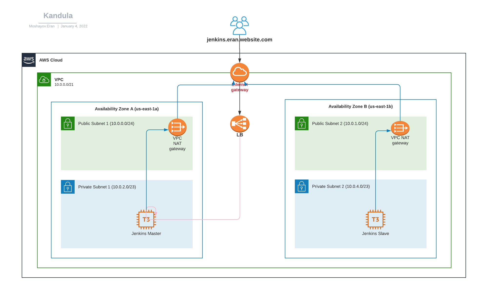
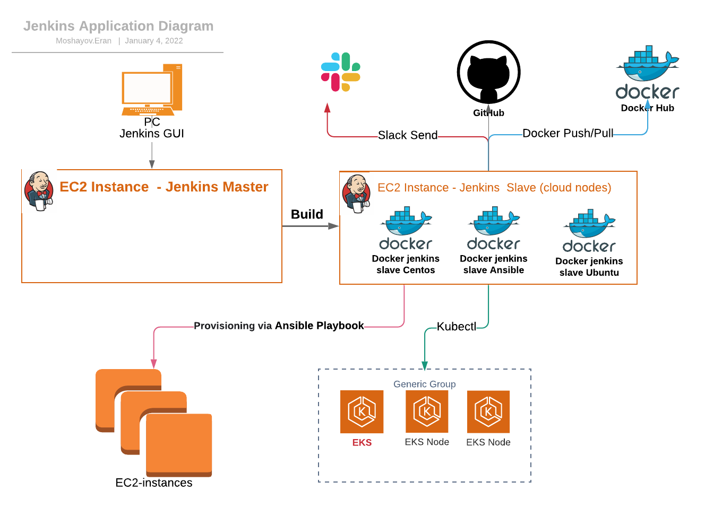

<h1 align="center">Terraform Jenkins</h1>

<h6 align="center">Terraform which creates Jenkins on AWS.</h6>

## Jenkins Infrastructure architecture diagram


## Application diagram



## Table of Contents

- [Prerequisites](#prerequisites)
- [Deploying Instructions](#deploying-instructions)
- [Variables References Table](#variables-references-table)
- [Data Flow Table](#data-flow-table)

## Prerequisites
To deploy all infrastructure you will need below application to be installed on your workstation/server
+ Install [GIT](https://github.com/git-guides/install-git) on your workstation/server
+ Install [Terraform v1.1.2](https://learn.hashicorp.com/tutorials/terraform/install-cli) on your workstation/server


## Deploying Instructions

Run the following:
   ```bash
   terraform init
   terraform apply --auto-approve
   ```

## Variables References Table

In below table you can see `variables.tf` file details:

| Variable | Type | Description |
| -------- | ----------- | ----------- |
| aws_region | string | AWS working region |
| aws_cli_profile | string | your awscli profile config |
| key_name | string | your pem key to access via ssh  |
| jenkins_master_name | string | The name of the Jenkins-master instance |
| jenkins_instance_type | string | The type of the ec2 instance |
| jenkins_master_ami | string | The AMI ID for Jenkins-Master |
| ebs_root_encrypted | string | if ebs should be encrypted true or false values |
| ebs_root_volume_type | string | EBS volume type like gp2... |
| ebs_root_volume_size | string | EBS volume size in G |
| ebs_root_delete_on_termination | string | if need to delete this EBS device with terminating instance true or false values |
| ebs_jenkis_master_volume_id | string | The EBS volume ID |
| ebs_device_name | string | Name of the device to mount |
| jenkins_slave_name | string | The of the Jenkins-slave instance |
| jenkins_slave_instances_count | string | amount of Jenkins-slave to create  |
| jenkins_slave_ami | string | The AMI ID for Jenkins-Slave |
| ubuntu_account_number | string | The AMI OS type of Jenkins-slave |
| ebs_root_volume_size_jenkins_slave | string | EBS root volume size in G |
| monitoring_bucket_name | string | AWS S3 Bucket name for monitoring logs (LB logs) |
| monitoring_bucket_prefix | string | The name of the folder that will store LB logs |
| aws_registered_domains | string | your aws registered domains |
| jenkins_dns | string | your aws  domains name for Jenkins-Master |
| private_hosted_zone_domain | string | aws private hosted zone domain name |
| default_s3_bucket | string | AWS s3 bucket for provisioning |
| consul_server | bool | tag - true of false value, if consul server need to be install value should be true |
| docker_engine | bool | tag - true of false value,If docker engine installed |
| node_exporter | bool | tag- true of false value,If need to install node exporter |
| asset_owner | string  | tag - Email, preferably distribution list of the project |
| environment | string | tag - Environment i.e DEV, QA, PPE, PROD |
| asset_id | string | tag - Asset insight of the project |
| environment_name | string | tag - The name of the Environment i.e |
| owner | string |tag - Full Name of the owner |
| project_name | string| tag - The Name of the Project |

## Data Flow Table

| Description | Source | Source Port | Destination  | Destination Port | Protocol |
| ----------- | ------ | ----------- | ------------ | -----------------| -------- |
| Jenkins to outside | Jenkins_Master | * | * | * | * |
| Jenkins_UI | * | *  | Jenkins_Master | 443 | TCP |
| Jenkins_UI | * | * | Jenkins_Master |  80 | TCP |
| Jenkins_UI | * | * | Jenkins_Master | 8080  | TCP |
| Docker_API | * | * | Jenkins_Master | 4243 | TCP |
| Docker_Hostport | * | * | Jenkins_Master | 32768-60999 | TCP |
| Node_Exporter | * | * | Jenkins_Master  | 9100 | TCP |
| Consul | * | * | Jenkins_Master |  8301 | TCP,UDP |
| Consul | * | * | Jenkins_Master |  8302 | TCP,UDP |
| Consul | * | * | Jenkins_Master |  8300 | TCP |
|   |   |   |   |   |   |
|   |   |   |   |   |   |


